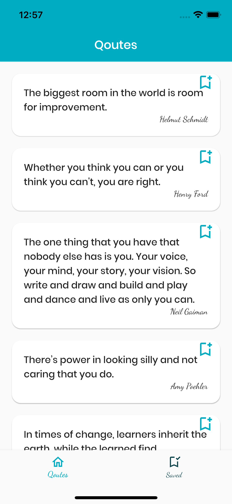
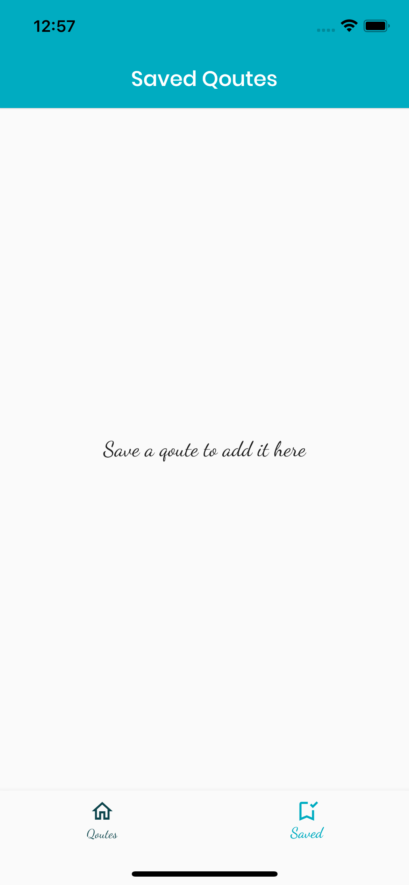

# Quotes App

This app demo was initially made for GDSC flutter workshop, Cairo University to demonstrate the use of http and local storage in flutter.

A year later, I thought of refactoring it, to share all the best practices I've learned so far.

This is the initial roadmap I have for the refactor, will be updated whenever there is a good thing to add.
The main points will be

- App Architecture
- Writing clean and organized code following SOLID principles

## Refactor Roadmap

- [ ] use [very_good_analysis](https://pub.dev/packages/very_good_analysis) for lints as a start
- [ ] setup melos (for managing packages)
- [ ] refactor app with layered architecture `(presentation/application/domain/data)`

  - [ ] domain layer (package)
  - [ ] data layer (package)
  - [ ] refactor ui to (presentation/application)

- [ ] use go_router for routing

## App Architecture

```

```

<br>
<br>



<br>
