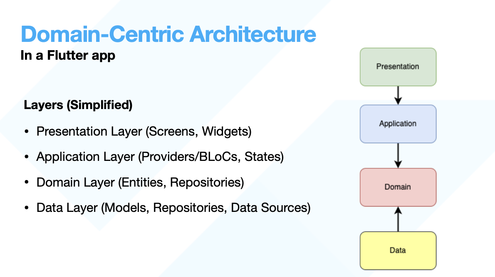
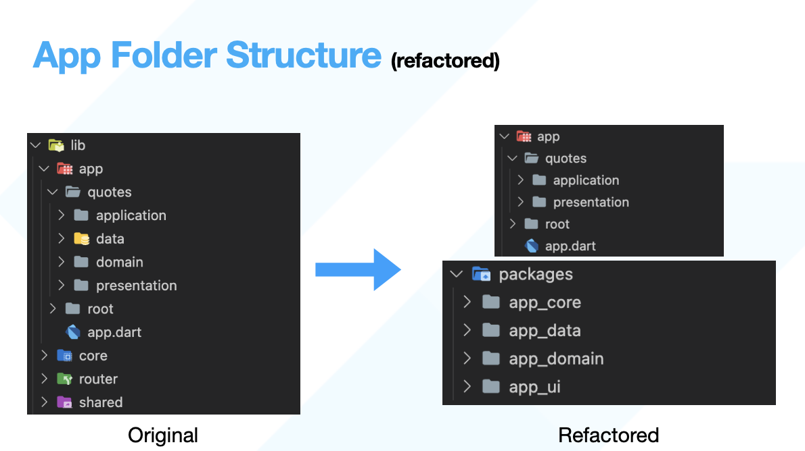

# Flutter Quotable

Flutter Quotable is a flutter app based on [Quotable API](https://github.com/lukePeavey/quotable). It is built to demonstrate the architecture purposed in this [presentation](https://drive.google.com/file/d/1odHgt_8XNGfnPeHkcrGeMNfkk1iuPV44/view) that was originally made for [FlutterBytes Conference](https://twitter.com/flutterbyteconf).

it will primarily focus on:

- App Architecture (using a [Domain-Centric Architecture](https://jlasoc.medium.com/what-is-domain-centric-architecture-e030e609c401#:~:text=The%20term%20was%20coined%20by,in%20technical%20and%20business%20contexts.))
- App Folder Structure (using packages and [Melos](https://melos.invertase.dev/))

### Quick Overview

For more info check the presentation mentioned above

 

# TODOs

### Architecture
- [x] Setup project packages `(presentation/application/domain/data)`
  - [x] presentation/application (flutter_quotable) package
  - [x] domain layer package
  - [x] data layer package
  - [x] core package
  - [x] ui package

### UI
- [x] add pagination support with [infinite_scroll_pagination](https://pub.dev/packages/infinite_scroll_pagination)
### Core
- [x] use [Dartz](https://pub.dev/packages/dartz) (Functional Programming) to improve error handling

### Data layer
- [x] use [injectable](https://pub.dev/packages/injectable) for registering dependencies

### Style

- [x] use [very_good_analysis](https://pub.dev/packages/very_good_analysis) for lints

 

## Contributing

Contributions are always welcome!

if you find any of the open todos suitable to you, submit a pr with it 
